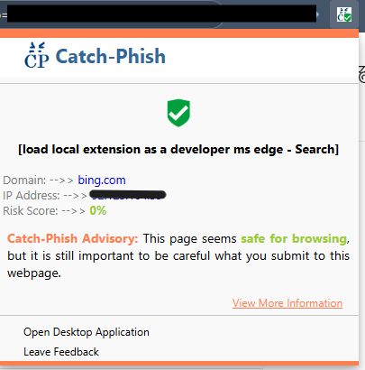

# CatchPhish — Browser Extension

Catch-Phish inspects the active browser tab's URL and page to provide a phishing/risk status. It uses IPQualityScore to score URLs and displays an advisory in the popup.
It works in Conjucion with the [CatchPhish Desktop Application](https://github.com/lemoncode-xo/CatchPhish) for detailed risk analysis on web pages as you browse.



## Contents
- `src/` — popup source JavaScript (bundled by webpack)
- `public/` — static extension files (manifest.json, popup.html, background.js, images/) — copied to `dist/` by the build workflow
- `dist/` — distribution folder; final extension files that can be zipped and published in Releases
- `scripts/` — small helper scripts: `copy-public.js`, `clean-dist.js`
- `.env.example` — example environment file to copy when setting up locally. It stores the API base/key for IPQualityScore.

## Quick start — end user (install from Releases)

1. Download the `CatchPhish-Browser-Extension-<version>.zip` from the [Releases page](https://github.com/lemoncode-xo/CatchPhish-Browser-Extension/releases/latest) and unzip it.
2. In Chrome/Edge go to `chrome://extensions`.
3. Enable Developer Mode.
4. Click `Load unpacked` and select the unzipped `CatchPhish-Browser-Extension-<version>.zip` folder.

Note: Browser stores are the recommended installation method for distribution; manual install is mainly for testing or private distribution.

## Quick start — developer
### 1. Install dependencies:

```bash
git clone https://github.com/lemoncode-xo/CatchPhish-Browser-Extension.git
cd CatchPhish-Browser-Extension
```

### 2. Create a local `.env` (copy `.env.example`) and set your API base:
```bash
cp .env.example .env
# then edit .env and set IPQS_API_BASE with your real key
```

### 3. Install Dependencies
```bash
npm install
```

### 4. Build (full workflow — clean, copy static files, bundle JS):

```powershell
npm run build:all
```

4. Load extension in Chrome/Edge:
- Open `chrome://extensions`
- Enable Developer Mode
- Click `Load unpacked` and choose the `dist/` folder


## Environment & secrets
- The API base/key is injected at build time. Do not commit your real API key to the repository.
- Use `.env` (gitignored) for local development. See `.env.example`.

## Build details
- Webpack bundles `src/index.js` into `dist/popup.js`. The build injects the `__IPQS_API_BASE__` constant from `.env` using DefinePlugin.
- Static files should be placed in `public/` so `npm run build:all` copies them into `dist/` before bundling.

## Troubleshooting
- If extension shows an offline or unsupported URL message, verify the API key and network connectivity.
- Use extension popup Inspect (right-click popup → Inspect) to open DevTools for console/network debugging.

## License
Apache-2.0

## Expected updates (short roadmap)
1. Fix native desktop app launch and query passing
	- Goal: Ensure the "Open Desktop Application" and "View More Information" actions reliably open the installed CatchPhish desktop app (when present) and pass the current tab URL as a query parameter.
	- Approach: standardize the custom URI scheme to a conventional form (for example `catchphish://open?url=<ENCODED_URL>`) and ensure the extension encodes the current tab URL before launching. This avoids fragile CLI-style argument formats and improves cross-platform compatibility.
	- Testing: manual verification steps will be added to the repo (Windows/macOS/Linux), including OS-level `start`/`open` commands and instructions for observing the fallback-to-download behavior when the app is not installed.
	- Developer note: the `DESKTOP_DOWNLOAD_URL` is currently set to the Releases page. It will remain as the fallback when the protocol handler is not found.

